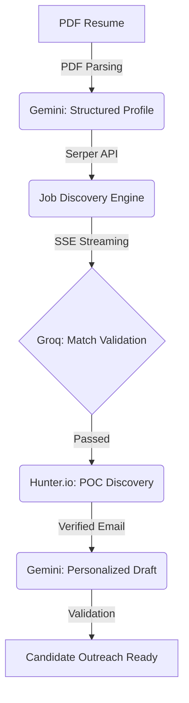

# 🚀 Pathfinder AI Suite

**The End-to-End Career Acceleration Engine**

Pathfinder is an intelligent, AI-driven platform designed to automate the most tedious parts of the modern job search. By bridging the gap between resume parsing, real-time job discovery, and personalized outreach, Pathfinder empowers candidates to find and apply for roles with unmatched speed and precision.

---

## 📊 Product Overview (PM Lens)

### The Problem
The current job market requires candidates to manually search through dozens of boards, parse dense job descriptions for relevance, find key stakeholders (Points of Contact), and craft hundreds of personalized "cold" emails. This process is fragmented, time-consuming, and prone to "application fatigue."

### The Solution
Pathfinder automates this entire lifecycle:
1.  **Extracts** structured data from messy PDF resumes.
2.  **Discovers** high-relevance job postings across the web via real-time search.
3.  **Validates** matches using LLM-grade scoring (Match > 0.7).
4.  **Enriches** data by finding verified emails for hiring managers.
5.  **Drafts** personalized outreach based on the candidate's unique profile and company news.

---

## 🛠 Technical Architecture (Tech Lead Lens)

Pathfinder is built with a **modular AI pipeline** architecture, utilizing **Server-Sent Events (SSE)** for a "streaming" UI experience that reduces perceived latency during complex multi-step background tasks.

### Core Pipeline Flow


### Key Technical Pillars
*   **Streaming Results:** The backend uses FastAPI + SSE to push job results to the frontend as they are discovered and validated, ensuring the user isn't stuck behind a loading spinner for minutes.
*   **Multi-Model Strategy:** 
    *   **Gemini 1.5:** Heavy lifting for resume parsing and creative drafting.
    *   **Groq (Llama-3):** High-speed, low-latency validation and filtering.
*   **Intelligent Scraping:** Integrates **Jina Reader** to convert complex career pages into clean, LLM-ready markdown for precise JD analysis.

---

## 💻 Tech Stack

| Layer | Technologies |
| :--- | :--- |
| **Frontend** | React (Vite), TypeScript, Tailwind CSS, Shadcn UI, Lucide Icons |
| **Backend** | FastAPI (Python), Uvicorn, Server-Sent Events (SSE) |
| **Generative AI**| Google Gemini, Groq (Llama-3.3-70b-versatile) |
| **External APIs**| Serper (Search), Hunter.io (Emails), Jina (Web Scraping) |

---

## 🚀 Getting Started

### Prerequisites
*   Node.js (v18+)
*   Python 3.10+
*   API Keys: Gemini, Groq, Serper, Hunter.io

### Installation

1.  **Clone the Repository**
    ```bash
    git clone https://github.com/debajyoti-product/pathfinder-ai-suite.git
    cd pathfinder-ai-suite
    ```

2.  **Frontend Setup**
    ```bash
    npm install
    npm run dev
    ```

3.  **Backend Setup**
    ```bash
    cd backend
    python -m venv venv
    source venv/bin/activate  # On Windows: venv\Scripts\activate
    pip install -r requirements.txt
    python main.py
    ```

---

## 📂 Project Organization

```text
├── backend/
│   ├── main.py            # API Gateway & SSE Routing
│   ├── evals.py           # LLM logic for JD matching & drafting
│   ├── services/          # usage_tracker, email_services, etc.
│   └── config.py          # API Key Management
├── src/
│   ├── pages/             # Main Application Tabs (Index.tsx)
│   ├── components/        # Shadcn/Custom UI Components
│   └── lib/api.ts         # SSE & Fetch handlers
└── context.md             # Project State Manifesto (Dev Reference)
```

---

## 🗺 Roadmap

- [ ] **POC Filter Hardening:** Enhanced logic to filtered out "former employees" from contact search.
- [ ] **Multi-Resume Support:** Allow users to swap profiles for different job tracks/industries.
- [ ] **Email Automation:** Direct integration with Gmail/Outlook for one-click sending.
- [ ] **Advanced Domain Heuristic:** Better handling of Hunter.io lookups for complex TLDs.

---
*Built with ❤️ by the Pathfinder Team.*
